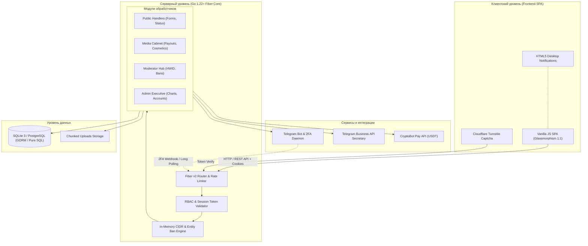

<div align="center">

# ⚡ Delta Media Portal (V2 Production)

**Высокопроизводительный веб-портал медиа-партнёрства, верификации и модерации сообщества [Delta Client](https://deltaclient.xyz)**

*Разработано на Go (Fiber v2), модульной SPA-архитектуре с эстетикой Delta Client 1:1, автоматизацией Telegram Business API, двухуровневой системой банов и циклом крипто-выплат.*

<br/>

[](https://golang.org)
[](https://gofiber.io)
[](https://postgresql.org)
[](https://core.telegram.org)
[](https://t.me/CryptoBot)
[](https://github.com/KurumaOfficial/Delta_Client_Media_Portal)
[](LICENSE)

<br/>

[🌟 Возможности](#-ключевые-возможности) •
[🏛 Архитектура](#-архитектура-системы) •
[🌿 Ветки репозитория](#-структура-веток-репозитория) •
[🚀 Быстрый старт](#-быстрый-старт) •
[⚙️ Переменные окружения](#️-конфигурация-окружения-env) •
[📡 REST API](#-спецификация-rest-api) •
[🧪 Тестирование](#-тестирование-и-верификация)

</div>

---

## 🌿 Структура веток репозитория

В репозитории принята чёткая семантическая организация веток:

| Ветка | Статус | Описание | Стек |
| :--- | :---: | :--- | :--- |
| **`main`** | **Active (V2)** | **Основная production-ветка.** Полный рекод портала на базе Go Fiber v2, SPA, 2FA, автономный бэкенд без внешних BaaS. | Go 1.22+, Fiber v2, SQLite / PostgreSQL, Vanilla JS SPA |
| **`V2`** | Development | Ветка разработки и внедрения новых модулей поколения V2. | Go 1.22+, Fiber v2 |
| **`Legacy`** | Archived (V1.4) | Историческая версия 1.4 клиентского портала (Supabase + клиентский JS). Сохранена для обратной совместимости и архива. | Supabase, HTML5, Vanilla JS |

---

## 🌟 Ключевые возможности

### 🔐 1. Аутентификация и безопасность Enterprise-уровня (Delta 2FA)
- **Беспарольная ролевая модель (RBAC)**: Вход осуществляется по уникальным криптостойким ключам доступа (`admin`, `moderator`, `media`, `freemedia`). Ключи выпускаются, отзываются и ротируются администратором.
- **Обязательный Telegram 2FA с геолокацией**: При вводе ключа сервер инициирует сессионный запрос в Telegram владельца ключа с указанием точного IP, юзер-агента, времени и GPS-координат на интерактивной карте. Вход невозможен без явного подтверждения владельцем.
- **Строгая типизация полей (Numeric UID)**: Поля ввода `UID` игрока и количества роликов защищены на уровне разметки (`inputmode="numeric"`, `pattern="[0-9]*"`), DOM-фильтрации нажатий клавиш и строгой серверной валидации Go.
- **Многоуровневый банлист (In-Memory CIDR Cache)**: Мгновенная блокировка по IP-адресам (с поддержкой CIDR-подсетей `/24`, `/16`), игровым UID, никнеймам Telegram и URL каналов YouTube/TikTok.

### 📊 2. Модуль аналитики и Executive-панель администратора
- **Векторная аналитика Безье**: Интерактивный динамический график динамики поступления заявок с гладкой интерполяцией кривых Безье, градиентным неоновым свечением и фильтрацией по таймфреймам (*День, Неделя, Месяц, Год, Всё время*).
- **Сетка метрик 1:1 в эстетике Delta Client**: 4 акцентных моноширинных счётчика в реальном времени:
  - *Медиа заявки (в очереди)*
  - *Сумма выплат за текущую неделю (USDT / RUB)*
  - *Активные Discord-баны*
  - *Активные аккаунты системы*
- **Центр управления платформой**: Мгновенное переключение приёма публичных заявок и режима технических работ в один клик.

### 💸 3. Финансовый модуль и цикл еженедельных выплат
- **Автоматизация CryptoBot (USDT)**: Генерация и автоматическая выплата инвойсов через официальный API CryptoBot прямо из панели управления при одобрении отчёта медиа.
- **Интеграция с FunPay**: Формирование готовых шаблонов ответов, ссылок на лоты и автоматический расчёт стоимости промокодов.
- **Недельный расчетный цикл**: Автоматическое открытие и закрытие расчетного окна выплат (`пн 00:00 — вт 22:00 МСК`), агрегация недельных отчётов и архивация данных.
- **Кастомные вознаграждения (Косметика)**: Динамическое поле выбора типа награды — при выборе косметики активируется ввод детального описания требуемого предмета с валидацией до 200 символов.

### 🛡️ 4. Кабинет модерации и работа с медиа-партнёрами
- **Досье кандидата**: Структурированная карточка со статистикой каналов (YouTube, TikTok), охватами, доказательствами и возможностью вынесения вердикта в один клик как в веб-интерфейсе, так и через кнопки бота в Telegram.
- **Desktop Push Notifications**: Нативная система уведомлений браузера (Desktop Notifications) для медиа-партнёров и модераторов о смене статуса их заявок, тикетов и выплат.
- **Сброс HWID и Discord-баны**: Выделенные реестры обработки запросов на сброс привязок оборудования и фиксации нарушений.
- **Потоковая чанковая загрузка (Chunked Uploads)**: Загрузка скриншотов и видео-доказательств любого размера (до нескольких гигабайт) с защитой от разрыва соединения и проверкой MIME-типов.

### 🤖 5. Telegram Business API & Умный секретарь
- **Интеллектуальный автоответчик**: Эмуляция поведения оператора с настраиваемой задержкой (15–180 сек), отображением статуса набора текста / выбора стикера и предварительным прочтением сообщений.
- **Контроль 24-часового окна Telegram Business**: Таймер обратного отсчёта до закрытия диалога с заблаговременным напоминанием клиенту за 5 минут.

---

## 🏛 Архитектура системы



---

## 📁 Структура кодовой базы

```
.
├── config/                  # Парсинг и типизация конфигурации окружения (.env)
├── internal/
│   ├── auth/                # Генерация сессий, криптографические ключи, 2FA
│   ├── bans/                # Высокопроизводительный движок банлиста (IP CIDR, UID, TG)
│   ├── database/            # Подключение к БД, схемы v2, миграции и сиды
│   ├── handlers/            # REST-обработчики (public, cabinet, admin, mod, bans)
│   ├── middleware/          # Security-заголовки, Real IP, Rate Limit, Audit Log
│   ├── models/              # Доменные структуры и модели базы данных
│   ├── payouts/             # Расчёт еженедельных периодов, валидация сумм, CryptoBot
│   ├── telegram/            # Бот, секретарь Business API, GPS-валидация 2FA
│   ├── uploads/             # Потоковая чанковая загрузка тяжелых медиафайлов
│   └── validation/          # Строгая серверная валидация входных данных
├── tools/
│   ├── frontend_test/       # E2E автоматические тесты UI на Puppeteer / Node.js
│   ├── e2e/                 # Интеграционные Go-тесты API
│   └── seedlocal/           # Генератор реалистичных демонстрационных данных
├── web/
│   ├── static/
│   │   ├── css/style.css    # Фирменная стилизация Glassmorphism 1:1 Delta Client
│   │   ├── img/             # Фоновые текстуры, логотипы, иконки
│   │   └── js/              # Модульный SPA движок (auth, admin, cabinet, public, ui)
│   └── views/index.html     # Единая точка входа SPA
├── main.go                  # Bootstrap приложения, Dependency Injection, graceful shutdown
├── go.mod                   # Декларация зависимостей Go
└── .env.example             # Полный образец конфигурационного файла
```

---

## 🚀 Быстрый старт

### Требования к окружению
- **Go**: Версия 1.22 или выше
- **Node.js**: Версия 18+ (только для запуска E2E тестов)
- **ОС**: Windows, Linux (Ubuntu/Debian/Alpine), macOS

### 1. Клонирование репозитория
```bash
git clone https://github.com/KurumaOfficial/Delta_Client_Media_Portal.git
cd Delta_Client_Media_Portal
```

### 2. Подготовка конфигурации
```bash
cp .env.example .env
```
Отредактируйте файл `.env`, указав секретные ключи, токен Telegram-бота и параметры БД. Для быстрого локального тестирования без Telegram GPS включите `DEV_AUTO_APPROVE_2FA=true`.

### 3. Запуск сервера

#### Вариант А: Быстрый локальный запуск (Windows)
```cmd
run-local.bat
```

#### Вариант Б: Запуск в Linux / macOS
```bash
chmod +x run-local.sh
./run-local.sh
```

#### Вариант В: Сборка и прямой запуск Go
```bash
go build -o delta-media-portal .
./delta-media-portal
```

Портал будет запущен и готов к приёму соединений по адресу: **`http://localhost:3999`** *(или на порту, указанном в `.env`)*.

---

## 🔐 Доступ по умолчанию и первый вход

1. Откройте портал в браузере: `http://localhost:3999`
2. Нажмите кнопку **«Личный кабинет»** в навигационной панели.
3. Введите мастер-ключ администратора: `DELTA-ROOT-0001` (или значение `ADMIN_BOOTSTRAP_CODE` из вашей конфигурации).
4. Если `DEV_AUTO_APPROVE_2FA=true`, вход произойдёт моментально без задержек. В продакшене подтверждение придёт в Telegram-чат администратора.

---

## ⚙️ Конфигурация окружения (.env)

| Переменная | По умолчанию | Описание |
| :--- | :---: | :--- |
| `PORT` | `3999` | Сетевой порт HTTP-сервера |
| `HOST` | `0.0.0.0` | Сетевой интерфейс для прослушивания |
| `DB_DRIVER` | `sqlite` | Драйвер базы данных (`sqlite` или `postgres`) |
| `DB_PATH` | `./local.db` | Путь к файлу базы данных при использовании SQLite |
| `DATABASE_URL` | - | Строка подключения PostgreSQL (используется при `DB_DRIVER=postgres`) |
| `SESSION_SECRET` | `secret-key-32-chars...` | Ключ шифрования сессионных cookie |
| `TELEGRAM_BOT_TOKEN` | - | Токен Telegram-бота из @BotFather |
| `TELEGRAM_CHAT_ID` | - | Основной чат для уведомлений администрации |
| `TELEGRAM_ADMIN_CONTACT` | `notyxs` | Telegram username для обратной связи и восстановления доступа |
| `TELEGRAM_STAFF_CONTACT` | `notyxs` | Telegram username контактного лица для заявок |
| `CRYPTOBOT_API_TOKEN` | - | API-токен CryptoBot для автоматических USDT выплат |
| `ADMIN_BOOTSTRAP_CODE` | `DELTA-ROOT-0001` | Начальный корневой ключ супер-администратора |
| `DEV_AUTO_APPROVE_2FA` | `false` | Автоподтверждение 2FA для разработки |
| `GPS_REQUIRED` | `true` | Требовать реальные GPS-координаты при входе через Telegram |
| `TURNSTILE_SITEKEY` | - | Публичный ключ защиты от ботов Cloudflare Turnstile |
| `TURNSTILE_SECRET` | - | Секретный ключ Cloudflare Turnstile для валидации на бэкенде |

---

## 📡 Спецификация REST API

### Публичный контур
- `GET  /api/health` — Состояние сервиса, статус технического режима и контакты администраторов.
- `POST /api/public/apply` — Подача заявки на медиа-партнёрство (с валидацией числового UID).
- `GET  /api/public/status?ticket=...` — Проверка статуса поданной заявки по номеру тикета.

### Контур авторизации
- `POST /api/auth/login-start` — Инициализация входа по личному коду, запуск сессии 2FA.
- `GET  /api/auth/2fa-poll?request_id=...` — Опрос статуса подтверждения 2FA в Telegram.
- `POST /api/auth/logout` — Инвалидация текущей сессии и очистка cookies.
- `GET  /api/auth/me` — Получение роли и профиля текущей активной сессии.

### Кабинет медиа-партнёра (`role: media`, `role: freemedia`)
- `GET  /api/cabinet/profile` — Профиль медиа-партнёра, статистика и баланс.
- `POST /api/cabinet/payout` — Запрос на выплату (USDT / FunPay / Косметика с кастомным описанием).
- `GET  /api/cabinet/history` — История заявок на выплаты и начислений.

### Модераторский контур (`role: moderator`, `role: admin`)
- `GET  /api/mod/applications` — Реестр поданных медиа-заявок с фильтрацией по статусам.
- `POST /api/mod/applications/:id/verdict` — Вынесение вердикта (`approved`, `rejected`) с комментарием.
- `GET  /api/mod/hwid-requests` — Запросы на сброс аппаратного HWID.
- `POST /api/mod/hwid-requests/:id/action` — Обработка сброса HWID.
- `GET  /api/mod/bans` — Просмотр активного банлиста.

### Панель администратора (`role: admin`)
- `GET  /api/admin/metrics` — Метрики, аналитические точки Безье, недельный статус окна выплат.
- `POST /api/admin/toggle-maintenance` — Переключение режима технических работ.
- `POST /api/admin/toggle-applications` — Включение / выключение приёма публичных заявок.
- `GET  /api/admin/accounts` — Управление персональными кодами доступа (генерация, блокировка).
- `POST /api/admin/accounts/create` — Выпуск нового персонального ключа с привязкой Telegram ID.
- `POST /api/admin/bans/add` — Добавление записи в банлист (IP, CIDR, UID, TG, Канал).
- `DELETE /api/admin/bans/:id` — Удаление записи из банлиста.

---

## 🧪 Тестирование и верификация

Проект снабжён полным набором автоматических тестов, гарантирующих надёжность каждого слоя системы.

### 1. Модульные тесты Go
```bash
go test -v ./internal/validation/...
```
Проверяет алгоритмы валидации числовых UID, каналов, формул расчёта выплат и фильтрации запрещённых символов.

### 2. Сквозные E2E тесты (Puppeteer)
```bash
# Запуск комплексного E2E тестирования функционала
node tools/frontend_test/comprehensive_test.js

# Запуск верификации ключевых требований UI/UX
node tools/frontend_test/verify_user_5_requirements.js
```
Тесты моделируют действия реального пользователя в браузере:
- Блокировка ввода букв в поля UID на уровне DOM-событий `keydown`, `paste` и `input`.
- Появление и валидация поля «Какая косметика» только при выборе опции косметики.
- Проверка кликабельности и корректности контактов `@notyxs` в окне восстановления кода.
- Работоспособность системных Desktop-уведомлений для модераторов и медиа.

---

## 🛡️ Безопасность

- Защита от подделки межсайтовых запросов (CSRF) и строгие `SameSite=Lax` Cookie.
- Автоматический сбор метрик подозрительной активности и Rate Limiting по IP.
- Защита от подбора ключей с временной блокировкой IP при превышении лимита неудачных попыток.
- Экранирование вывода и строгая параметризация всех запросов к БД, исключающая SQL-инъекции.

---

<div align="center">

**[Delta Client](https://deltaclient.xyz)** &copy; 2024–2026. Разработано с бескомпромиссным вниманием к качеству и производительности.

</div>
